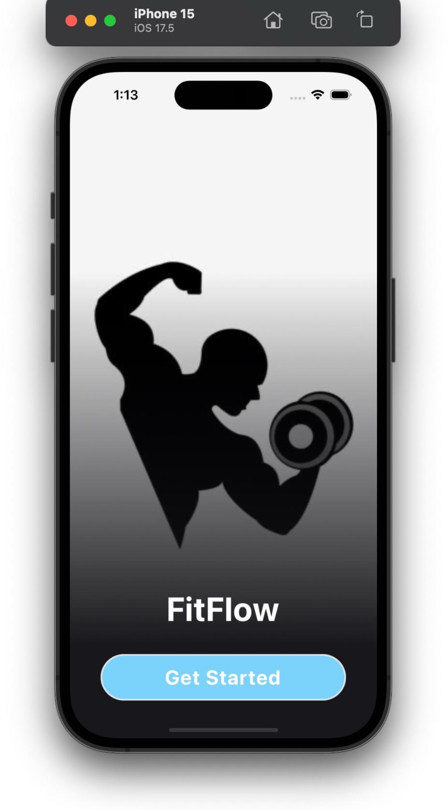
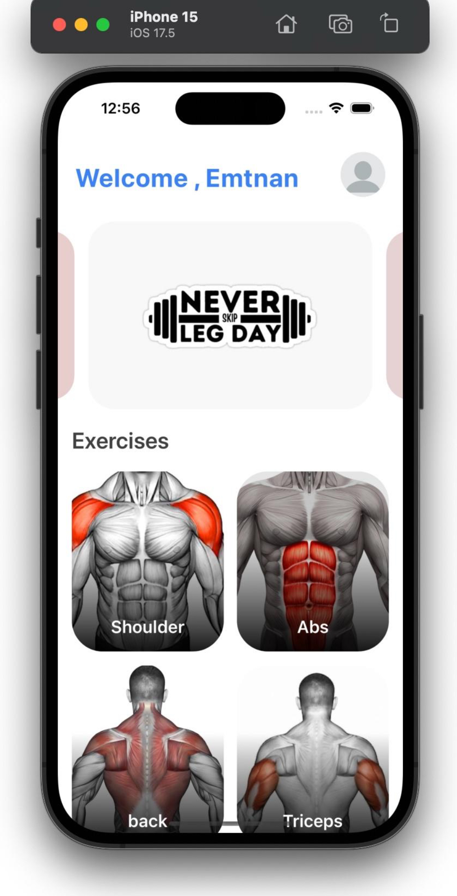
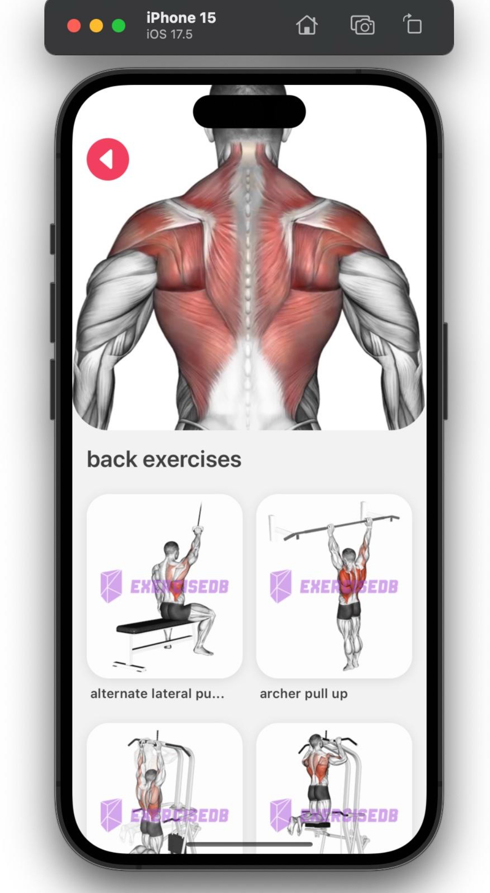
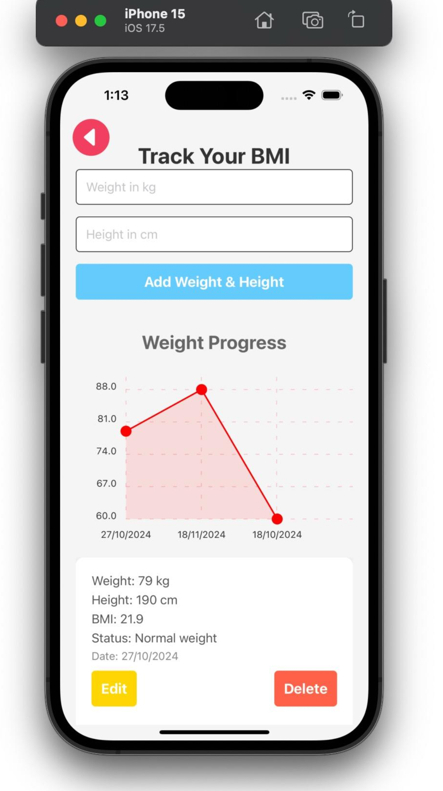

# FitFlow - Fitness App

FitFlow is your ultimate companion for a healthier lifestyle, offering structured guidance and intuitive features. The app provides exercise tutorials categorized by muscle groups and equipment, complete with detailed descriptions and visual aids. Additionally, a built-in BMI calculator provides insights into body composition, empowering users to set achievable fitness milestones. The sleek, user-friendly interface ensures an engaging experience, making fitness both effective and sustainable for users of all levels.



Home Screen


Exercise Page


BMI Tracker 



## Technologies & Tools
- React Native  
- Firebase  
- Cascading Style Sheets (CSS)  
- HTML  
- JavaScript eXtension (JSX)  
- Animation  

## Getting Started: Your Guide to FitFlow

### 1️⃣ Install Dependencies

```bash
npm install
```

### 2️⃣ Run the App

#### To run the app in development mode:

```bash
npm start
```

- The app will open in [Expo](https://expo.io) on your phone.
- It will reload automatically when you save edits.

#### To run the app on iOS:

```bash
npm run ios
```

- Similar to `npm start`, but attempts to open the app in the iOS simulator.

#### To run the app on Android:

```bash
npm run android
```

- Similar to `npm start`, but attempts to open the app on a connected Android device or emulator.

